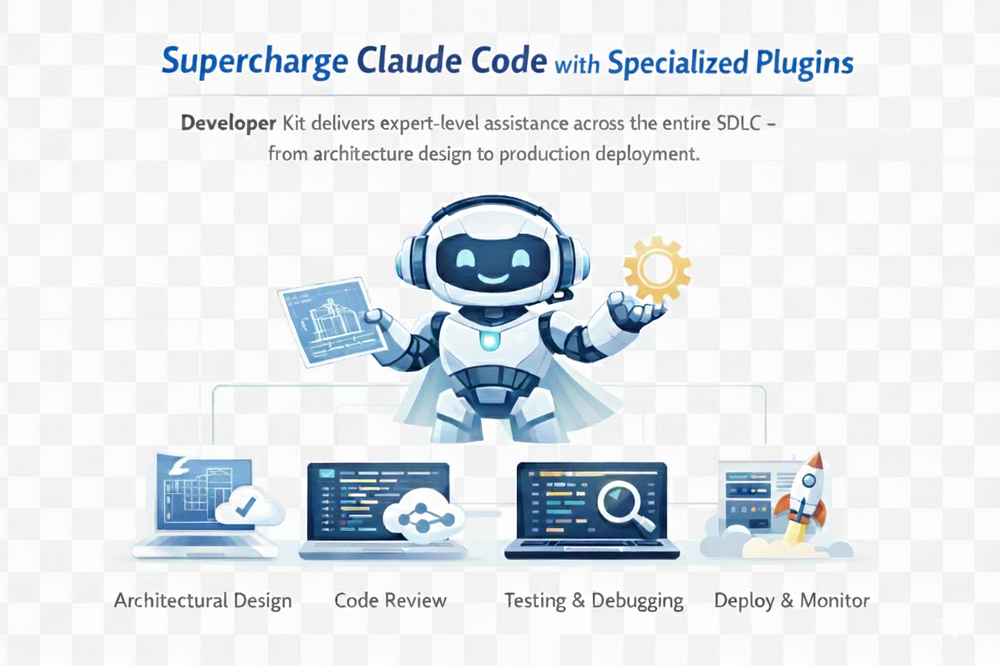

# Claude Code Plugin Marketplace



A curated collection of plugins for Claude Code extending its capabilities with specialized skills, agents, and commands.

## Installation

```bash
claude
/plugin marketplace add https://github.com/claudebase/marketplace.git
/plugin
# Select and install plugins interactively
```

### Alternative: Local Install

```bash
git clone https://github.com/claudebase/marketplace.git
claude plugin install ./marketplace/developer-kit
```

### Plugin Management

```bash
claude plugin list                    # List installed plugins
claude plugin enable <plugin-name>    # Enable a plugin
claude plugin disable <plugin-name>   # Disable a plugin
claude plugin uninstall <plugin-name> # Remove a plugin
```

## Available Plugins

### Developer Kit

Comprehensive development assistant with 24 skills, 14 agents, and 21 commands.

| Component | Description                                                                           |
| --------- | ------------------------------------------------------------------------------------- |
| Commands  | `agent`, `build`, `git`, `workflow`, `release`, `analyze`, `start`, `check`, etc.     |
| Skills    | `analyze`, `debug`, `design`, `implement`, `security`, `devops`, `test`, `a11y`, etc. |
| Agents    | `architect`, `code-reviewer`, `database-admin`, `security-expert`, etc.               |

See [developer-kit/README.md](./developer-kit/README.md) for full documentation.

## Creating a Plugin

### Directory Structure

```
my-plugin/
├── .claude-plugin/
│   └── plugin.json      # Required manifest
├── commands/            # Command definitions
├── agents/              # Agent definitions
├── skills/              # Skill definitions
│   └── my-skill/
│       └── SKILL.md
└── .mcp.json            # MCP server config (optional)
```

### plugin.json

```json
{
  "name": "my-plugin",
  "version": "1.0.0",
  "description": "My custom plugin",
  "author": { "name": "Your Name" },
  "license": "MIT"
}
```

### Skill (SKILL.md)

```yaml
---
name: my-skill
description: "Purpose. Activates for: 'trigger1', 'trigger2'"
allowed-tools:
  - Read
  - Grep
  - Glob
---
# My Skill

Instructions for the skill.
```

### Command

```yaml
---
description: "What this command does"
delegates-to: skill-name # Optional
---
# Command Name

Instructions. Use $ARGUMENTS for user input.
```

### Agent

```yaml
---
name: my-agent
description: "Agent description and triggers"
tools: Read, Grep, Glob, Write
model: sonnet
---
# My Agent

Agent instructions and focus areas.
```

### MCP Server (.mcp.json)

```json
{
  "mcpServers": {
    "my-server": {
      "command": "npx",
      "args": ["-y", "@myorg/mcp-server"],
      "env": { "API_KEY": "${API_KEY}" }
    }
  }
}
```

## Installation Scopes

| Scope     | Location                      | Use Case                      |
| --------- | ----------------------------- | ----------------------------- |
| `user`    | `~/.claude/settings.json`     | Personal (default)            |
| `project` | `.claude/settings.json`       | Team (version controlled)     |
| `local`   | `.claude/settings.local.json` | Project-specific (gitignored) |

## Debugging

```bash
claude --debug   # Debug output
/mcp             # Check MCP server status
```

## License

MIT
